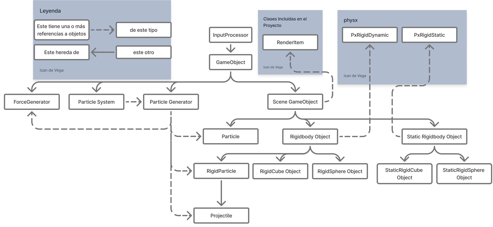

# Galactic Armada


> Final project for a Physics Simulation in Videogames course at Universidad Complutense de Madrid.  
> A 3D space shooter built to demonstrate a **custom physics engine layer on top of NVIDIA PhysX** — force generators, particle systems, rigid body dynamics, and spring constraints.



---

## About

Built solo. The game — destroy 10 enemy ships — is intentionally lightweight; the real deliverable is the physics layer underneath. Every mechanic maps directly to a physics primitive: thruster thrust is a force generator, explosions are triggered particle bursts, and the boleadoras weapon is a live two-body spring constraint evaluated each tick.

**Why it's an interesting physics problem:**
- Force generators must compose cleanly — multiple forces apply per object per tick without coupling
- Particle systems must be data-driven to configure distinct effects without subclassing
- Spring projectiles require genuine two-body constraint simulation, not visual approximations
- Integrator choice is visible — wrong integrator breaks spring energy conservation immediately

---

## Gameplay

Destroy 10 enemy ships to win.

### Weapons
| Weapon | Mechanic |
|---|---|
| Laser (LMB, hold) | Rapid-fire from 4 cannons, cycling through all four |
| Boleadoras (RMB) | Two projectiles joined by a live spring constraint |
| Missile (Space) | Single slow heavy projectile |

### Controls
| Input | Action |
|---|---|
| Mouse position | Ship orientation — distance from center controls rotation speed |
| W | Thruster — accelerate in look direction |
| A / D | Roll on forward axis |

### Enemy AI
Each `EnemyShip` applies directional thrust toward the player and uses torque to steer — `think_off_torque()` computes corrective torque each tick to face the player. On death: triggers an explosion `TriggeredParticleGenerator`, delays destruction by 3 seconds for the effect to play out.

---

## Technical Highlights

| System | What was built |
|---|---|
| **Force generator framework** | Polymorphic strategy pattern — every force inherits `ForceGenerator`, applied per-object via `apply_force(GameObject&)` |
| **Particle system** | Data-driven via lambda configs — position, direction, velocity, lifetime, color, size, mass all configurable without subclassing |
| **Rigid body dynamics** | Custom `Rigidbody_Object` wrapper over `PxRigidDynamic` — torque, velocity control, transform sync |
| **Symplectic integrator** | Semi-implicit Euler — velocity before position, better energy conservation than explicit Euler for spring systems |
| **Spring projectile** | Two rigid bodies + live `OBJ_OBJ_Spring_ForceGenerator` — real two-body constraint evaluated each tick |
| **Statistical distributions** | `Distributions` namespace over `<random>` — uniform, normal (3σ presets), random sign |

### Force Generator Framework
Extensible, polymorphic force system. Every force type inherits from `ForceGenerator` and applies per-object via `apply_force(GameObject&)`.

| Generator | Physics |
|---|---|
| `Gravity_ForceGenerator` | Mass-scaled gravitational force |
| `Wind_ForceGenerator` | Aerodynamic drag — uses air density + drag coefficient (Cd) |
| `TorbellinoSencillo` | Vortex with height-bounded area of influence |
| `Spring_ForceGenerator` | Hooke's law — both object-object and point-anchored variants |
| `Floating_ForceGenerator` | Buoyancy based on fluid density and submersion |
| `Variable_ForceGenerator` | Time-varying force via `std::function` lambda — arbitrary curves |

### Particle System
Data-driven particle architecture. Each `ParticleGenerator` takes a config of lambda functions that compute per-particle initial position, direction, velocity, lifetime, color, size, and mass. This makes spawning highly configurable without subclassing for each effect.

Three generator modes:
- `ParticleGenerator` — continuous emission at configurable rate
- `TriggeredParticleGenerator` — one-shot burst on `trigger()` call (used for explosions)
- `ToggleParticleGenerator` — on/off toggle (used for engine thrust)

Particles self-cull by lifetime or area-of-interest predicate (also a configurable lambda).

### Rigid Body Dynamics
Built on `PxRigidDynamic`. Custom `Rigidbody_Object` wrapper exposes torque application, velocity control, and transform synchronization. Static/dynamic variants for scene geometry and active objects.

### Integration
Semi-implicit (symplectic) Euler by default — velocity updated before position, giving better energy conservation than explicit Euler for spring systems. Configurable at compile time via `#define`.

### Spring Projectile (Boleadoras)
Two rigid bodies connected by a spring. `SpringJoinedProjectileLauncher` spawns both particles and attaches an `OBJ_OBJ_Spring_ForceGenerator` between them — real two-body spring constraint simulated through force application each tick.

### Statistical Distributions
`Distributions` namespace wraps `<random>` into reusable samplers: uniform `[0,1]`, normal distribution (three σ presets), and random sign. Used to randomize particle spawn parameters.

---

## Architecture

See the [architecture diagram](Diagrama_arquitectura.jpg) and full [project report](Izan_de_Vega_Memoria_Proyecto_Final_físicas.pdf) for detailed system design, torque graphs, and implementation notes.

**Stack:** C++ · NVIDIA PhysX · OpenGL · GLUT

**Key design patterns:** Component hierarchy (`SceneObject → RigidbodyObject → Ship/EnemyShip`), strategy pattern for force generators, descriptor/factory pattern for particle systems.

### Unified Scene Graph — Everything Is a `GameObject`

The engine's core achievement is that the entire world is a single tree of `GameObject` nodes. **Scenes themselves are `GameObject`s** — each wraps a PhysX `PxScene*` and owns all its children via `std::list<std::unique_ptr<GameObject>>`. Adding anything to the world is always the same call: `addChild()`.

This uniformity has cascading consequences:

- **`step(dt)`, `render3D()`, and all input handlers recurse through the tree automatically** — no registration lists, no manual update loops, no special cases
- **`ForceGenerator` is also a `GameObject`** — attaching gravity to a scene is `addChild(new Gravity_ForceGenerator(...))`, identical to adding a ship or a particle burst
- **Transforms (position + quaternion rotation) live on the base class** — anything can be moved or rotated the same way, from the scene root down to a single particle

The inheritance chain layers capabilities without breaking this uniformity:

```
GameObject
└── SceneObject          (adds RenderItem — visual mesh + color)
    ├── SphereObject     (adds radius)
    │   └── Particle     (adds lifetime — self-culls when expired)
    │       └── RigidParticle  (adds PhysX rigid body)
    │           └── Projectile (adds gravity multiplier)
    └── Rigidbody_Object (adds PxRigidDynamic — full physics sim)
        ├── Ship         (adds player input + cannon system)
        └── EnemyShip    (adds AI steering torque)
```

Each level adds exactly one responsibility. Everything below inherits update, render, and input propagation for free through the tree.

---

## How to Build

Requires Visual Studio on Windows with the NVIDIA PhysX SDK installed.

1. Open the `.sln` in Visual Studio
2. Set PhysX SDK include and library paths in project properties
3. Build Debug or Release — integrator type is selected at compile time via `#define`

---

## Author

**Izan de Vega López** — sole author. Full design, implementation, and technical documentation.

---

## References

- [NVIDIA PhysX Documentation](https://nvidia-omniverse.github.io/PhysX/physx/5.1.0/)
- [Game Physics Engine Development — Ian Millington](https://www.crcpress.com/Game-Physics-Engine-Development/Millington/p/book/9780123819765)
- [Project Report (PDF)](Izan_de_Vega_Memoria_Proyecto_Final_físicas.pdf)
